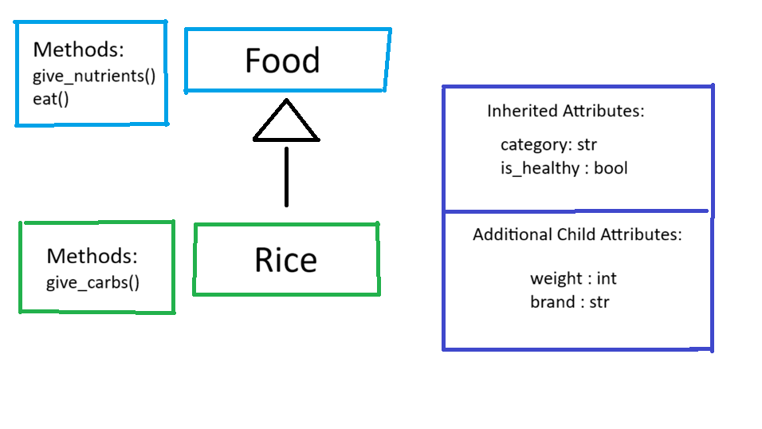
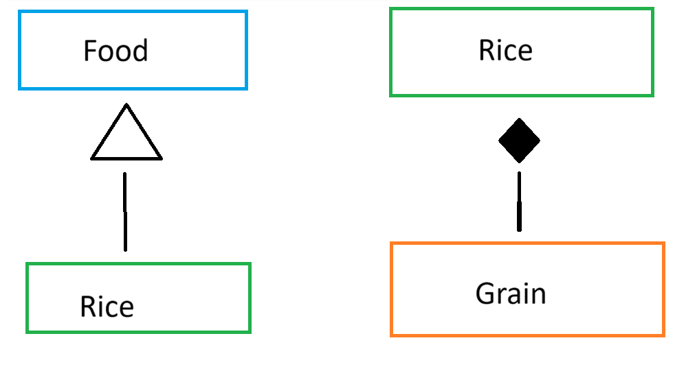
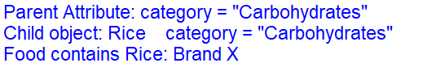
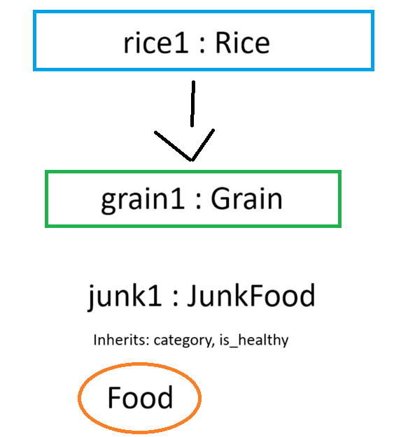

# Advanced Class Relationships
## Previous Activities
[classAttrib](classAttributesMethods.md)
[classRel](classRelationships.md)

## Existing System Description:
1.) Class 1: Calculator       Class 2: Pencil Case
2.) Repeated attribute of price, which both items have a price that marks their value

## Inheritance Relationship
Parent: Food
Child: Rice
Explanation: Rice is a type of the food.

## Inheritance UML

## Composition/Aggregation
Relationship: Composition
Explanation: If food disappeared, rice would also be gone.

## Advanced UML Diagram

## Python Implementation
[Source Code](advancedRelationships.py)

## Test Run

## Object Diagram

## Reflection
Answers:
1. I chose my inheritance relationship, as in food there are many types. There could be junk foods, canned, and more. Whereas Rice is a type of food.
2. Inheritance made assigning variables and giving information to the classes easier to be put without repetition. The attribute of category was reused both in the parent and child class. This helped reduce too much code.
3. I chose the inheritance relationship of composition. This is because child class rice would not exist if there is no parent class of food. 
4. The one in part III only showed the objects gotten from the class. On the other hand, the advanced relationship showed the inheritance of the classes, showing to use the parent class for the child class. Thus, the advanced one showed a more detailed idea of the classes
5. It follows it, as it helps in the association of each class. This is by the parent and child class to connect their variables. Also, to aid in the code reduction for more simplified use.
