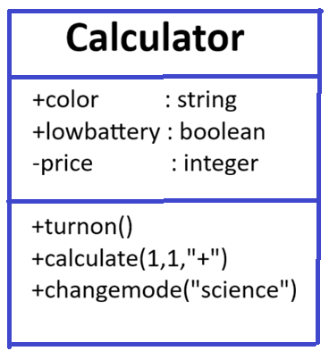
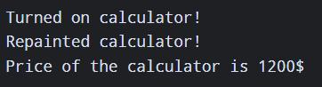
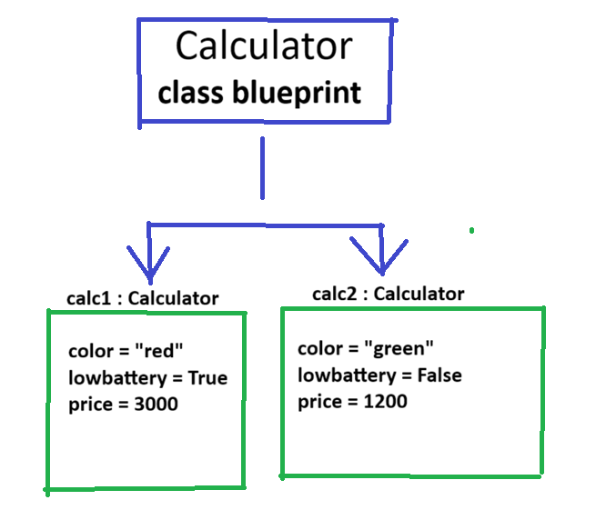

# Class Attributes and Methods

## Previous Design

Link to my previous activity:
[classObjectUML.md](https://github.com/u23urwurhuih/CS3-Portfolio/blob/main/q1/classObjectUML/classObjectUML.md)

## Design Revision
No major changes were needed from my original design.

## Visibility Decisions
| Attribute | Data Type | Visibility | Reason |
|+color|string|public|The color of the calculator must be seen by its user|
|+lowbattery |boolean |public |The user must see this in order to replace its battery |
|-price|integer |private |The price tag must not be seen if the calculator is bought at a low price |

## Updated UML Class Diagram

## Python Implementation

[View Python Source](classImplementation.py)
## Test Run

## Object Diagram

## Analysis

### Why did you make your chosen attribute private?
As price may be hidden for which the calculator is given as a present, so the receiver may not know if it is cheap or not.
### Which method changes the state of your object?
repaint()
### How did your two objects demonstrate that instances are independent?
As they are different from each other, which their color, if they are low in battery, and price are different.
### What is the difference between your class diagram and your object diagram?
The class diagram shows the blueprint or the layout of the idea of the calculator. The object diagram is the implementation of the blueprint as for different values in color, price, and low in battery.
