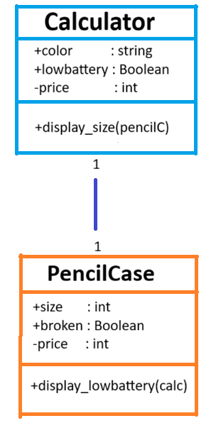
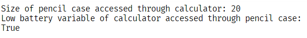
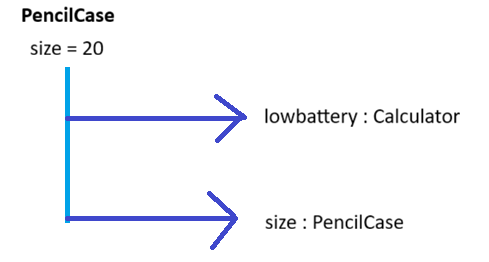

## Previous Work
[Part I - Classes and Objects](https://github.com/u23urwurhuih/CS3-Portfolio/blob/main/q1/classObjectUML/classObjectUML.md)
[Part II - Class Attributes and Methods](classAttributesMethods.md)

## Existing Class
Class: Calculator
Description: My class represents a calculator, which has data. It has attributes of brand, price, and low battery; it has a method to calculate.

## New Related Class
Class: Pencil Case
Description: My class represents a pencil case, which is used to store many things. It has attributes of size, price, and broken; it has a method to keep.

## Association
Relationship: A pencil case includes a calculator.
Explanation: A pencil case stores many things for students' needs, which one thing is a calculator.

## Multiplicity

Multiplicity: one-to-one
Explanation: As each pencil case usually stores one calculator.

## UML Class Relationship Diagram

## Python Implementation
[View Python Source](classRelationships.py)
## Test Run

## Object Relationship Diagram

## Analysis
### What is the association between your two classes?
A pencil case includes a calculator

### What multiplicity did you choose and why?
one-to-one, as each pencil case usually stores one calculator

### How did you implement the relationship in Python?
through accessing an attribute by connecting 2 classes. Like class1.class2.attribute

### Why did you store an object reference instead of copying its data?
So the reference can be used through another class

### If your relationship uses many, why is a list appropriate?
So all attributes can be accessed, which the list holds all the attributes to be referenced.
